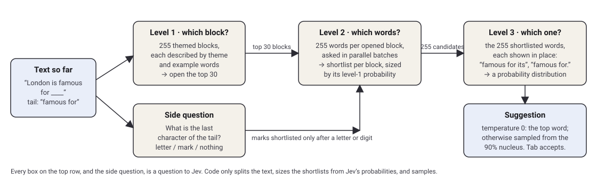

# Jev Language Model

[](https://github.com/sashakaletsky/jev-language-model/actions/workflows/ci.yml)
[](LICENSE)
[](docs/DATA.md#licences)

**Live at [jevlanguagemodel.com](https://jevlanguagemodel.com).**

A next-word predictor built entirely from [Jev](https://typesafe.ai), TypeSafe's System One decision
model. Jev cannot generate text. It answers typed questions: pick one of up to 255 options, and say how
confident it is about each. This project asks whether that is enough to behave like a language model.
You type a word, it suggests the next one, you press **Tab** to accept.

**No other model is involved at inference time.** No n-grams, no frequency tables, no prefix matching,
no repetition penalties. Every suggestion is the product of Jev's answers and nothing else.



## Try it

With a TypeSafe API key:

```bash
git clone https://github.com/sashakaletsky/jev-language-model
cd jev-language-model
npm install
cp .env.example .env.local        # put your key in TYPESAFE_API_KEY
npm run dev                       # http://localhost:3000
```

Without a key, against a local stand-in that answers with made-up probabilities (useful for working on
the interface or the plumbing, useless for judging Jev):

```bash
npm run dev:mock
```

Node 22.18 or newer. The dictionary files are committed, so Python is only needed to rebuild them.

### Deploy your own

[](https://vercel.com/new/clone?repository-url=https%3A%2F%2Fgithub.com%2Fsashakaletsky%2Fjev-language-model&env=TYPESAFE_API_KEY&envDescription=Your%20TypeSafe%20API%20key%20(server-side%20only)&project-name=jev-language-model)

One environment variable, `TYPESAFE_API_KEY`, set for both Preview and Production. No database.
Nothing about visitors is stored. If you share the link widely, turn on your host's firewall rate
limiting for `/api/predict`; the app's own limiter is per server instance and only slows abuse down.

## How it works

The 65,025 most frequent English words (255 × 255, contractions and slang included) are arranged into
**255 themed blocks of 255 words**. After every finished word, the server asks Jev three questions about
the text so far. Nothing is asked mid-word.

1. **Level 1, 255 options: which themed block holds the next word?** Jev sees each block's theme and a
   few example words, such as *Verbs | movement & travel (most common): go, come, walk, run…* The
   thirty likeliest blocks are opened.
2. **Level 2, 255 options per opened block, in parallel batches of ten: which of its words is it?**
   Each block contributes a shortlist sized by its level-1 probability, with a small floor so every
   opened block is represented. Together the shortlists make exactly 255 candidates.
3. **Level 3, 255 options: which of those candidates?** Each is shown in place at the end of the text,
   so Jev compares *"Hello how are"* against *"Hello how you"* as phrases. Its answer is a full
   probability distribution over the 255.

Alongside level 1 rides one small side question: *what is the very last character of the text?* The
four punctuation marks `.` `,` `?` `!` live in the core block like any other option, so Jev can end or
pause a sentence, but they are shortlisted only when Jev says the text ends with a letter or digit.
That stops a stray full stop echoing into `..` and `...`.

Every question is framed as filling in a blank. Jev sees the text with `____` where the next word goes,
the last few words repeated in a `tail` field, and a few worked examples. The instructions ask for the
word an articulate person, speaking clearly, would most naturally say next, and say that good speech
moves forward rather than piling up synonyms, and that a new sentence begins a new thought. That framing
matters: asked plainly "what comes next?", a decision model favours words that already appear in the
text and ends up repeating the last one.

At temperature 0 the top level-3 word is the suggestion. Above 0 the suggestion is sampled from the
nucleus of the distribution (the smallest set covering 90% of the probability) in proportion to
p^(1/T), so the second or third choice sometimes wins and runs of one word are broken up, without
tail words ever being drawn.

Code does nothing else. It straightens curly apostrophes and bounds the context sent
([`lib/tokenize.ts`](lib/tokenize.ts)), sizes the shortlists from Jev's probabilities, and samples
([`lib/predict.ts`](lib/predict.ts)). The site shows all three decisions for every word, with
probabilities, latency and token usage, and can display the exact request and response JSON of each
call.

## Settings

| Variable | Default | Meaning |
| --- | --- | --- |
| `TYPESAFE_API_KEY` | required | Your TypeSafe key. Server-side only. |
| `TYPESAFE_BASE_URL` | `https://api.typesafe.ai` | Point it at `npm run mock` to run without a key. |
| `JEV_FANOUT` | `30` | Blocks opened at level 2, up to 50. More blocks give the final round more variety; each one is a 255-option question per word, so tokens scale with it. Adjustable in the UI. |
| `JEV_TEMPERATURE` | `0.8` | Sampling temperature for the suggestion; 0 always takes the top candidate. Adjustable in the UI. |
| `JEV_MAX_FANOUT` | `50` | The most blocks a visitor may open. |
| `JEV_RATE_LIMIT` | `40` | Requests per visitor per 10 seconds before the API answers 429, per server instance. |
| `NEXT_PUBLIC_JEV_PRICE_PER_M_INPUT_TOKENS` | `0.042` | Dollars per million input tokens, used only for the "You have spent" readout. The default is Jev's published rate; output tokens are free. |

The client asks only once a word has been finished with a space or a mark, waits 250 ms after the last
keystroke, and answers identical inputs from a small cache.

### Cost and latency

Three sequential calls per word, roughly 400 to 600 ms in total; level 2 runs its batches in parallel.
Tokens per word are dominated by level 1, whose request carries all 255 block descriptions (about
36,000 characters), plus one 255-option question per opened block. The panel reports exact usage for
every prediction. The dials are the number of blocks opened and the example words per block in
`scripts/build_blocks.py`.

## API

```
POST /api/predict   { "text": "I want to ", "fanout": 30, "temperature": 0.8, "trace": "summary" | "full" }
GET  /api/predict?text=I%20want%20to%20&trace=full
GET  /api/blocks              the 255 block descriptions Jev reads at level 1
GET  /api/blocks?id=<block>   one block with its 255 words
```

`text` should end where a word has been finished. The response carries the level-3 candidates, the
sampled `chosen` suggestion, the opened blocks, the shortlist quotas, Jev's answer about the text's
ending, token usage, timing and a `trace` of every call. With `trace=full` the trace includes the
complete option sets exactly as sent.

## Measuring accuracy

[`scripts/harness.mjs`](scripts/harness.mjs) replays the same three questions over real text. It hides
a word, shows Jev the text before it, and counts exact matches at temperature 0. Jev is the only model
in the loop; scoring is string equality.

```bash
npm run dev                                  # in one terminal
npm run harness                              # 100 samples from the bundled public-domain excerpt
npm run harness -- --corpus my.txt --samples 200 --fanout 10 --out results.json
```

```
n   | top-1  | top-5  | block hit | tokens/pred | ms/pred
100 | ...    | ...    | ...       | ...         | ...
```

"Block hit" is whether the hidden word's block was among those opened at level 2, which separates
level-1 mistakes from later ones. The bundled corpus is an excerpt of *Alice's Adventures in
Wonderland*; any plain-text file works, and text closer to what you type will say more.

## The data

Built once, in advance, and committed. Jev never sees anything else.

- `data/words.json`: the 65,025 words, from [wordfreq](https://github.com/rspeer/wordfreq) by one
  stated rule.
- `data/taxonomy.json`: 89 hand-written themes.
- `data/labels.json`: one theme per word, assigned by Claude following
  [`docs/LABELLING.md`](docs/LABELLING.md).
- `data/blocks.json`: the 255 blocks and their descriptions, cut by
  [`scripts/build_blocks.py`](scripts/build_blocks.py).

[`docs/DATA.md`](docs/DATA.md) has the full provenance, every judgement call, the licences, and how to
rebuild or relabel.

## Project layout

```
app/                Next.js app: the page, the editor component, the two API routes, the icons and social preview image
lib/                The predictor (predict.ts), block loading, tokenising, the TypeSafe client
data/               Generated dictionary, themes, labels and blocks
scripts/            Data build scripts (Python), the mock API, dev:mock, the harness
tests/              Node test suite; runs the whole pipeline against the mock
docs/               Labelling instructions, data provenance, the pipeline diagram
corpus/             A public-domain excerpt for the harness
```

## Development

```bash
npm run check        # lint, typecheck, tests, production build; CI runs the same
npm test             # the tests alone, no key or network needed
npm run mock         # the stand-in API on its own, for curl experiments
```

See [CONTRIBUTING.md](CONTRIBUTING.md) for the one rule of the project, where things live, and how
to propose prompt or data changes.

## Questions people ask

**Why 255?** Jev's Choice question takes at most 255 options. 255 × 255 = 65,025 is the largest
dictionary two such choices can cover exactly, and it happens to be a generous vocabulary.

**Why themed blocks rather than alphabetical ones?** Because level 1 then asks something a language
model can judge from meaning and grammar: *is the next word a verb of motion, a food noun, a linking
word?* An alphabetical split would ask it to guess a first letter.

**Why does it still repeat itself sometimes?** Decision models score options that already appear in
the input highly. The blank framing, the worked examples, the in-place phrases at level 3, the
punctuation gate and nucleus sampling each chip away at that, but none of them is a repetition penalty,
because that would be code deciding. What remains is an honest picture of the model.

**Can I swap in another decision model?** The only TypeSafe-specific code is `lib/jev.ts` and the
`choice()` calls in `lib/predict.ts`. Anything that answers a 255-way choice with a probability per
option could be dropped in.

**Is it really only Jev?** Open Settings at the foot of the site, tick "Show the raw Jev calls" and read the requests. The tests
in `tests/` also pin down what code is allowed to do.

## Licence

Code is MIT (see [`LICENSE`](LICENSE)). The word list and the files derived from it are built from
[wordfreq](https://github.com/rspeer/wordfreq) data, which is
[CC BY-SA 4.0](https://creativecommons.org/licenses/by-sa/4.0/), and are shared under the same licence.
Details in [`docs/DATA.md`](docs/DATA.md#licences).
